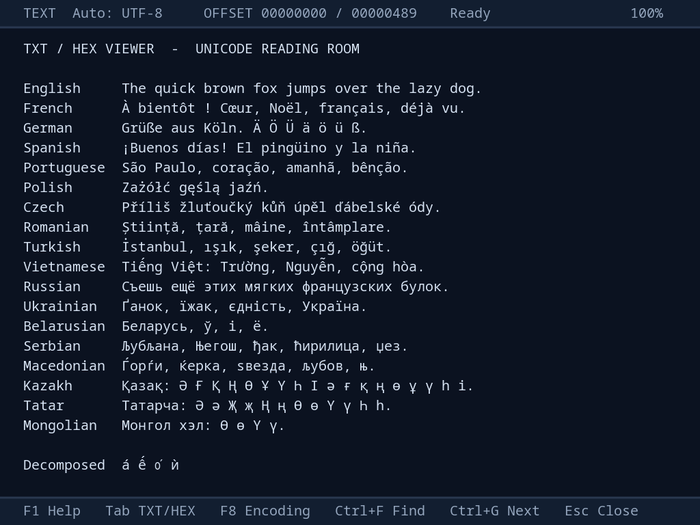

# TXTVIEW2 v0.26 — TXT/HEX для VDAC2, 1024×768

Новый графический просмотрщик Wild Commander Improved, написанный с нуля
14 сентября 2026 года. В нём использованы потоковый движок TXTVIEW v0.26
и транспорт FT812 из предоставленного проекта
`Weather screensaver VDAC2`. Обычный `TXTVIEW.WMF` остаётся отдельным плагином.



**Пользователь подтвердил: после явного SCISSOR разрывы строк исчезли.**
Ограничение каждой текстовой строки и все шесть коэффициентов матрицы
сохранены. В этой сборке ускорены Up/Down и добавлены проценты справа вверху.
Новая строка готовится в запасной невидимой полосе, остальные строки
переиспользуются. Файл `nedoos.txt` (31 626 байт) проверен во всех 839
экранных строках. Проверка новой прокрутки на физической плате ещё впереди.

## Установка

1. Скопировать готовые [`TXTVIEW2.WMF`](../../../exe/WC/TXTVIEW2.WMF) и
   [`TXTVIEW2.LIC`](../../../exe/WC/TXTVIEW2.LIC) из `exe/WC` в папку `WC`
   загрузочного носителя. Шрифт уже находится внутри WMF; TTF на носитель
   копировать не требуется. `TXTVIEW2.LIC` содержит лицензию встроенного шрифта.
2. В секции `[PLUGINS]` своего `WC/wc.ini` заменить строку `TXTVIEW.WMF`
   (или прежнюю `RE.WMF`) на `TXTVIEW2.WMF`.
3. Перезапустить WC и открыть файл по **F3**. Через **Shift+F3** плагин
   также доступен под названием `TXT / HEX - VDAC2`.

Нужна плата VDAC2/FT812 с поддержкой режима 1024×768. В Unreal включается
`TS_VDAC2=1`. Если FT812 не отвечает, плагин возвращает экран WC и показывает
английское сообщение. `FILEX.WMF`, загруженный перед просмотрщиком, ускоряет
позиционное чтение. Без FILEX работает последовательный совместимый путь.

## Просмотр и управление

- Сглаженный **Noto Sans Mono**, 20 пикселей, шаг 12 пикселей; 78 колонок ×
  **22 строки**. Сверху — одна строка состояния, снизу — клавиши управления.
  Оба бара высотой 40 пикселей, надписи выровнены по вертикальному центру.
  Название просмотрщика, имя файла и декоративная полоса слева убраны.
- Справа вверху — процент позиции в файле. До последней страницы это
  `Top × 100 / FileSize`; когда виден конец файла — **100%**. Короткий файл,
  целиком помещающийся на экране, и пустой файл сразу показывают 100%.
- **Up/Down** разбирают только появившуюся строку и обновляют одну запасную
  полосу; готовые строки сдвигаются сменой координат в дисплей-листе.
- **CP866, CP1251, UTF-8**: автоматическое определение по началу файла и
  ручное переключение F8: `Auto → CP866 → CP1251 → UTF-8 → Auto`.
  Активная кодировка и `Auto`/`Man.` всегда видны.
- Автодетект CP866/CP1251 эвристический. Чистый ASCII совместим со всеми
  тремя кодировками; при отсутствии многобайтового UTF-8 в первых 4 КиБ
  выбирается однобайтовый вариант. В неоднозначном файле используйте F8.
- Длинные строки переносятся по ширине экрана. Поддержаны CR, LF, CRLF,
  табуляция через 8 колонок и NUL внутри файла. UTF-8 BOM скрывается
  только при просмотре в UTF-8.
- HEX: 16 байтов в строке, восьмизначное смещение и текстовая колонка
  исходных байтов в CP866. Переключение кодировки не меняет сами HEX-байты.
- Смещения и размеры **32-битные**, до `FFFFFFFF`. Кэш файла — **4 КиБ**;
  весь файл и отдельная длинная строка в память не загружаются.
- Файл открывается только для чтения. Интерфейс, нижний бар и вся помощь
  всегда **английские**, включая русскую раскладку клавиатуры WC.

| Клавиши | Действие |
|---|---|
| Up / Down | Предыдущая / следующая экранная строка |
| PgUp / PgDn | Предыдущая / следующая страница |
| Home / End | Начало / конец файла |
| Tab | TXT ↔ HEX; позиция возвращается к началу |
| F8 | Следующая кодировка; позиция возвращается к началу |
| F1 | Английская справка |
| Ctrl+F / Ctrl+G | Найти / найти следующее вхождение |
| Ctrl+Shift в поле поиска | Переключить раскладку WC |
| Esc | Отменить долгий проход; при обычном просмотре — закрыть |
| Space | Закрыть просмотрщик |

Поиск чувствителен к регистру. Поле WC принимает до 40 символов CP866
(латиница и русская раскладка), затем запрос переводится в выбранную кодировку
файла. Поиск сравнивает исходные байты; нормализация и поиск произвольного
Unicode через расширенный метод ввода не реализованы.

Переход End в файл с большой FAT-цепочкой может быть долгим: FILEX.READ_AT
работает синхронно. Esc проверяется на границах заполнения кэша; текущий вызов
дискового API плагин принудительно не прерывает. Обратная навигация по строке
длиной в мегабайты также требует прохода по её началу и отменяется Esc.

## Шрифт и Unicode

Встроены **2 278 кодовых точек**, всего **2 862 глифа** с дополнительными
сочетаниями диакритик. Это не преобразование Unicode в ограниченный шрифт
CP866: кириллические буквы CP1251 сохраняются непосредственно в Unicode.

Латиница включает Latin-1, Extended-A/B, Additional (в том числе вьетнамские
буквы), доступные в исходном шрифте Extended-C/D/E. Кириллица включает
`0400–052F`, `1C80–1C8F`, `A640–A69F`: украинские, белорусские, сербские,
македонские, казахские, татарские, монгольские и другие кириллические буквы.
Также включены современная греческая азбука, пунктуация, валюты, стрелки,
часть математических символов и псевдографика.

Поддержаны **1 175 пар композиции**: канонические сочетания с диакритиками
`0300–036F` и дополнительные кириллические буквы с острым/тупым ударением.
Например, `e + ◌̂ + ◌́` выводится как `ế`, а `о + ◌́` занимает одну клетку.
Неизвестное сочетание показывает отдельный знак с пунктирным кружком.
Полная перестановка произвольных комбинируемых знаков Unicode не выполняется.

UTF-8 проверяется строго: overlong, суррогаты, одиночные продолжения и коды
за пределом Unicode отвергаются. Неподдержанные символы, включая символы
вне BMP, и некорректные последовательности показываются знаком замены `�`.
Точный перечень символов и композиционных пар создаётся в `build/font.json`.

Исходный TTF **Noto Sans Mono Regular 2.007** сохранён без изменений,
лицензия **SIL OFL 1.1** находится в [`fonts/OFL.txt`](fonts/OFL.txt).
Некоторые широкие диграфы и выносные диакритики вписываются в клетку шириной
12 пикселей при генерации атласа; штрихи не обрезаются. После исправления
бюджета FT812 такие знаки немного уже прежнего варианта с клеткой 16 пикселей.

Источники шрифта: [официальный проект Noto](https://notofonts.github.io/latin-greek-cyrillic/),
[TTF](https://github.com/notofonts/noto-fonts/blob/main/hinted/ttf/NotoSansMono/NotoSansMono-Regular.ttf).

## Сборка и проверки

Python 3.12, SjASMPlus 1.21.0 и зависимости из `requirements-dev.txt`:

```powershell
python -m pip install -r requirements-dev.txt
powershell -NoProfile -ExecutionPolicy Bypass -File .\build.ps1
```

Путь к ассемблеру можно передать параметром `-AssemblerPath` либо переменной
`SJASMPLUS`. В данном рабочем окружении он по умолчанию берётся из
`Desktop\sjasmplus\sjasmplus-1.21.0.win`. Временный `subst` устраняет ограничение
SjASMPlus на кириллицу в путях и снимается даже при ошибке сборки.

Скрипт создаёт атлас из локального TTF, собирает `TXTVIEW2.WMF` прямо в
каталоге плагина и запускает машинные проверки ядра. После успешных проверок
готовый WMF и лицензия шрифта автоматически копируются в `exe/WC` репозитория.
Общая сборка WC также пересобирает и устанавливает этот плагин. В `build`
хранятся ресурсы, листинг, символы и материалы проверок.
Никаких загрузок из сети при сборке нет. Общий стенд файловых API берётся
из `tests/core32_unreal/test_txthex_viewer.py` репозитория WC.

Полный набор с официальной DLL эмулятора FT812:

```powershell
# При необходимости указать каталог Unreal с bt8xxemu.dll:
$env:BT8XXEMU_DIR = 'C:\path\to\Unreal'
powershell -NoProfile -ExecutionPolicy Bypass -File .\build.ps1 -TestGraphics
```

`tests/test_viewer.py` исполняет собранный Z80, проверяет все Unicode-глифы и
композиции, строгий UTF-8 и обе кодовые страницы, разрывы кэша, навигацию,
поиск, отмену, ошибки ввода и отсутствие FT812. Графический тест сверяет
**583 848 байт RAM_G** с атласом и **365 976 байт** кэша строк, проверяет
все 2 862 глифа при копировании и ограничение **8 КиБ дисплей-листа**.
Всего **20 тестов**: добавлены обороты кольца в обе стороны, EOF, отмена и
ошибка чтения без изменения экрана, границы 64 КиБ/16 МиБ/2 ГиБ/4 ГиБ,
точный процент и попиксельное сравнение прокрутки с полной сборкой кадра.
Плотная страница из 22 строк без пробелов занимает **368 / 2 048 слов**.

### Исправление бюджета 1344 такта на растровую строку

Прежний вывод одной командой на глиф давал 1 997 слов DL. Проверка только
8 КиБ RAM_DL была недостаточной: при `HCYCLE=1344`, `PCLK=1` весь список
нужно заново прочитать за 1 344 такта каждой растровой строки. Руководство
описывает выборку одной команды за такт и обычную скорость L4 NEAREST
16 пикселей за такт ([FT81x Programming Guide, раздел Performance](https://brtchip.com/wp-content/uploads/2025/02/BRT_AN_088_FT81x_BT88x-Programming-Guide.pdf)).

Атлас теперь хранит столбцы глифов подряд. `CMD_MEMCPY` собирает готовые
строки в RAM_G, а FT812 выводит каждую строку одним bitmap с перестановкой
координат X/Y. Сглаживание L4 сохраняется; панели и разделители по-прежнему
нарисованы прямоугольниками. Неизменённые клетки повторно не копируются.

В `build/scanline-budget.json` записана оценка для реально переданного DL:
выборка слов, очистка, перекрытия bitmap/прямоугольников и резерв 128 тактов.
Предположение 16 пикселей/такт для транспонированного чтения RAM_G не
подтверждено на плате. Поэтому прежнее число **1146 / 1344** и новые оценки
**742 / 1344** (плотная страница), **1188 / 1344** (справка) нельзя считать
доказательством приёмки бюджета. DLL и Unreal подтверждают команды и
пиксели, а не физические тайминги. В частности, флаг DLL `DynamicDegrade`
относится к загрузке компьютера. При изменении команд тест требует
дополнить модель; отчёт явно отмечен `unverified`.

При открытии и переходе страниц собирается вся сетка. При Up/Down кольцо
содержит **22 видимые полосы + одну запасную**. Z80 разбирает только новую
строку, `CMD_MEMCPY` обновляет только невидимую полосу, затем `CMD_SWAP`
переставляет готовые строки. До успешного чтения состояние экрана не меняется.
Обычный Up использует историю границ; при её промахе длинную строку по-прежнему
нужно просканировать назад. Полная смена страницы использует общий кэш.

Замер последовательных реальных команд на `nedoos.txt`, медиана 12 шагов:

| Команда | До, тактов Z80 | После, тактов Z80 | Ускорение |
|---|---:|---:|---:|
| Down | 3 985 436 | 419 982 | 9,49× |
| Up | 4 103 345 | 367 340 | 11,17× |

Включены разбор строки, проценты и передача FT812; время диска/WC API
подменено стендом. Это стоимость кода, не замер отзывчивости физической платы.
В UTF-8 получено 8,44–9,21×, в HEX 7,34–7,43×. Отчёт:
`build/scroll-performance.json`, исходный бинарник и замер — `build/scroll-before`.
Повторение: `python tools/benchmark_scroll.py C:/path/to/nedoos.txt --output build/scroll-performance.json --baseline build/scroll-before/performance.json`.

Точный пример пользователя проверяется без изменения исходного файла:
`python tools/check_nedoos.py C:/path/to/nedoos.txt --output build/nedoos-check`.
Стенд сохраняет SHA-256 файла/WMF, полный DL, кадры и результат сверки RAM_G.
Сравнение кадров до/после SCISSOR на трёх позициях дало ноль различающихся
пикселей: ограничение высоты 34 не отрезает элементы глифов.

Для изолированной проверки в WC служат `tools/prepare_unreal.py` и
`tools/check_unreal.py`. Подготовка использует ранее проверенный стенд
`Build/txtview-rename-20260914`; существующий каталог прогона не перезаписывается.
Клавиши подаются через интерфейс Unreal, RAM только читается. Снимки берутся
из текущего окна `VDAC2 Emul`, поскольку старый `ft812_dump.bmp` стенда
сохраняет лишь каждый шестой изменившийся кадр и может быть устаревшим.

Результаты сборки, машинного исполнения и Unreal не являются проверкой
на физической плате ZX Evolution/VDAC2.

## Устройство кода

| Файл | Назначение |
|---|---|
| `src/main.asm` | WMF-заголовок, жизненный цикл, API WC и страницы |
| `src/stream.inc`, `navigation.inc`, `hex.inc`, `search.inc` | Потоковое ядро v0.26 |
| `src/decoder.inc`, `unicode.inc`, `detect.inc` | Строгий декодер, Unicode, композиции и выбор кодировки |
| `src/ft812.asm` | SPI, тайминги, FIFO, загрузка ресурсов, ограниченные ожидания |
| `src/view.inc`, `screen.inc`, `ui.inc` | Сетка текста, дисплей-лист, справка и поиск |
| `tools/gen_assets.py` | Детерминированный L4-атлас и Unicode-таблицы |

Код находится в `8000–A7FF`, история 256 переходов — `A800–AFFF`, кэш —
`B000–BFFF`. Страница 1 плагина содержит Unicode-таблицы, страницы 2–9 —
сжатый атлас. Всего WMF занимает 10 страниц WC, файл — **157 696 байт**.
Атлас и полосы используют вместе **949 824 / 1 048 576 байт RAM_G**.
В свободной видеостранице `2000` хранит текущую сетку, `3000` — последнюю
переданную сетку для сравнения. Обе сетки хранят физические слоты кольца;
`RowRing` задаёт первый видимый слот, `RowOffsets` хранит логический порядок.

Сначала читается экранная сетка в свободную видеостраницу, затем выполняется
обмен с FT812. Дисковый API никогда не вызывается при выбранном FT812:
SD и FT812 используют одну SPI-шину. Перед восстановлением режима WC
подключается свободная видеостраница, поскольку GEDPL пишет в `1000–1447`.
Это сохраняет таблицы шрифта для повторных запусков.
